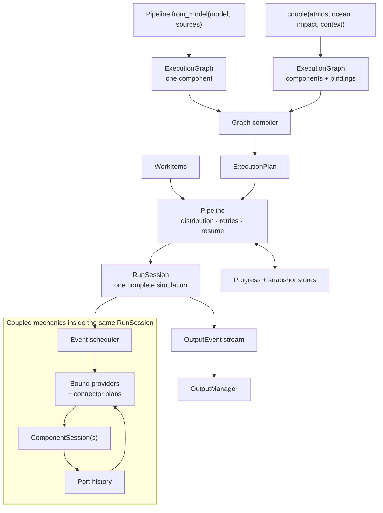

# Pipeline–Coupler Collaboration Interface

**Status:** Earlier interface draft. `dev/spec/EXECUTION_CONTRACT_SPEC.md`
is authoritative for the current execution boundary: shared component metadata,
distinct direct and graph loops, composable output transforms, and optional
complete predownload/checkpoint support. The one-path compiler requirement and
protocol sketches below are historical design context.
**Date:** 23 September 2026
**Target:** Earth2Studio `1.0.0-rc`
**Related proposals:** `execution.md`, `pipelines.md`, `Impact_modeling.md`,
`alignment.md`

## 1. Purpose

This note identifies the interface that the Pipeline and coupled/impact-model
efforts need to design and implement together. It is intentionally narrower than
either proposal: it describes the shared waist between them, assigns ownership on
each side, and sketches the first protocol shapes to test.

The intended result is one execution path:

- a simple forecast is a one-component graph;
- a coupled or impact workflow is a multi-component graph; and
- `Pipeline` supervises both without containing either model-specific or
coupling-specific rollout logic.

The code below is illustrative. Names and exact field splits can change during the
first implementation, but the responsibilities and information flow should not.
`unification.md` is explicitly outside the sources for this draft.

## 2. The shared boundary

The key agreement is that `ExecutionPlan` and `RunSession` form the boundary
between the two efforts:

- The **coupler/graph runtime** compiles components, providers, bindings,
transforms, and schedules into an `ExecutionPlan`, then executes one work item
as a `RunSession`.
- **Pipeline** distributes work items, chooses ensemble groupings, supervises
retries and resume, persists snapshots and progress, and routes emitted events
through `OutputManager`.

Pipeline may inspect compiled component and output metadata for routing, ownership, progress, and observability, but it must not schedule individual components or branch its execution loop based on graph topology. The coupler must not implement work distribution, output backends, progress tracking, or a competing top-level driver.




For a simple forecast, the coupled-mechanics box contains one model component and
source-backed inputs. For DLESyM, it contains separate atmosphere and ocean
sessions, multi-rate scheduling, connector history, and explicit exchange
bindings. Nothing above `RunSession` changes.

## 3. Items requiring joint agreement


### 3.1 Static field and port declarations

Both planning and coupling need one metadata-only declaration of what a component
consumes and publishes. It must be inspectable without fetching data, loading model
weights, or allocating model state.

```python
@dataclass(frozen=True)
class FieldRequirement:
    slot: str
    variables: tuple[str, ...]       # canonical or qualified lexicon labels
    signature: CoordinateSystem
    phase: Literal["initialize", "step"]
    schedule: Schedule
    lead_offsets: tuple[np.timedelta64, ...] = ()
    optional: bool = False
    fallback: Fallback | None = None
    freshness: np.timedelta64 | None = None


@dataclass(frozen=True)
class OutputPort:
    name: str
    variables: tuple[str, ...]
    signature: CoordinateSystem
    schedule: Schedule
```

Canonical units come from structured shared-lexicon metadata, not per-variable
DataArray attributes. Qualified temporal labels use the shared time-statistics
vocabulary. Ports separate outputs with different grids, cadences, or valid-time
coordinates; every position published on a port is semantically valid.

**Collaboration needed:** settle the module location, exact split between
`CoordinateSystem` and grid metadata, how fallbacks are represented, and how model
requirements are derived rather than restated by component wrappers.

### 3.2 Model stepping and hook semantics

Stateful models that participate in step-time coupling or restart expose their
state and RNG explicitly. Iterator-only models remain supported for ordinary
inference with reduced capability.

```python
ModelState = Mapping[str, xr.DataArray]


@dataclass(frozen=True)
class StepResult:
    state: ModelState
    output: xr.DataArray
    rng: RNGState


class SteppablePrognosticModel(Protocol):
    def initialize(self, x: xr.DataArray, *, rng: RNGState) -> StepResult: ...

    def step(
        self,
        state: ModelState,
        imports: Mapping[str, xr.DataArray] | None = None,
        *,
        rng: RNGState,
    ) -> StepResult: ...

    def state_coords(
        self, input_coords: CoordinateSystem
    ) -> Mapping[str, CoordinateSystem]: ...
```

`step()` is hook-free, like the current `__call__()`. Steppable iterators apply
hooks around the transition:

```python
StateHook = Callable[[ModelState], ModelState]
TransitionHook = Callable[[StepResult], StepResult]
```

The transition hook can keep published output and recurrent state consistent.
Each migrated wrapper explicitly maps its existing DataArray hooks into these
structures; the runtime does not guess a state key.

**Collaboration needed:** choose the first reference wrappers and document their
state projections. DLESyM is the coupled gate; one simple DataArray model should
be the single-component gate. Model migration and coupler work need to agree on
this protocol before independently inventing adapter state.

### 3.3 Component adapter and session

The adapter isolates model-specific invocation. The graph runtime schedules only
component sessions and named ports.

```python
class ComponentAdapter(Protocol):
    spec: ComponentSpec

    def open(
        self,
        initial: Mapping[str, xr.DataArray],
        *,
        rng: RNGState,
    ) -> "ComponentSession": ...


class ComponentSession(Protocol):
    checkpoint_capability: CheckpointCapability

    def step(
        self,
        activation_time: np.datetime64,
        inputs: Mapping[str, xr.DataArray],
    ) -> Mapping[str, xr.DataArray]: ...  # output port -> valid data

    def snapshot(self) -> ComponentSnapshot: ...
    def restore(self, snapshot: ComponentSnapshot) -> None: ...
```

Standard adapters should cover steppable prognostics, iterator-only prognostics,
single-call models, stateless diagnostics, and ordinary callables. Dedicated
DLESyM atmosphere and ocean adapters may be specialized, but they must expose real
component step boundaries rather than run the fused model twice.

**Collaboration needed:** agree on adapter capability reporting, initialization
inputs, ownership of adapter-held history, and the minimum snapshot conformance
test.

### 3.4 Sources and component outputs as providers

Sources and components remain distinct public concepts. They converge only after
resolution into an internal provider used by a binding plan.

```python
class BoundProvider(Protocol):
    def value_at(
        self,
        request: ResolvedRequest,
        context: ActivationContext,
    ) -> xr.DataArray | None: ...
```

The exact method shape is intentionally provisional. This minimal draft presents a
ready value synchronously; a source-backed adapter may coordinate asynchronous
fetch or prefetch behind it. If live fetching requires an async interface, the
provider, session event stream, and Pipeline loop should be lifted together rather
than mixing an async provider into an otherwise synchronous session. A
component-backed provider reads an already-published port history. The consumer
and Pipeline do not branch on which one supplied the value.

**Collaboration needed:** settle sync/async behavior, history ownership, optional
absence, and how provider errors are surfaced. This interface must serve live,
prefetched, predownloaded, static, fallback, and component-output providers.

### 3.5 Bindings, transformations, and schedules

A binding is port- and field-specific. Scientific timing is declarative rather
than encoded by manually ordering actions.

```python
@dataclass(frozen=True)
class Binding:
    source: PortRef
    target: PortRef
    fields: tuple[str, ...]
    availability: Literal["current", "previous"]
    transforms: tuple[TransformSpec, ...] = ()


class Schedule(Protocol):
    def iter_between(
        self,
        reference_time: np.datetime64,
        start: np.datetime64,
        stop: np.datetime64,
    ) -> Iterator[np.datetime64]: ...

    def fingerprint(self) -> str: ...
```

The coupler implementation owns the concrete schedule algebra. It must cover fixed
cadence with origin/phase, irregular events, and forecast-relative activation
without eager expansion. Binding transforms compile through a metadata-only
resolution phase before any values are touched.

**Collaboration needed:** Pipeline needs stable schedule and transform fingerprints
for plan/progress identity, but does not interpret them. The coupler needs the
shared grid, lexicon, and temporal-statistics contracts rather than local
alternatives.

### 3.6 Execution plan and run session

The compiler is coupler/graph-owned; its result is the object Pipeline executes.

```python
class ExecutionGraph:
    components: Mapping[str, ComponentAdapter]
    bindings: tuple[Binding, ...]

    def compile(
        self,
        item: WorkItem,
        providers: ProviderRegistry,
    ) -> "ExecutionPlan": ...


class ExecutionPlan(Protocol):
    identity: str

    def describe(self) -> str: ...
    def open(
        self,
        item: WorkItem,
        snapshot: RunSnapshot | None = None,
    ) -> "RunSession": ...


class RunSession(Protocol):
    def run(self) -> Iterator["OutputEvent"]: ...
    def snapshot(self) -> RunSnapshot: ...
```

Compilation resolves every required provider, validates units/grids/cadences and
cycles, compiles transforms and schedules, derives output schemas and external
source requests, and computes stable identity. It must fail before model compute
or field allocation.

**Collaboration needed:** define exactly which plan fields contribute to identity,
which parts are serializable, and whether a homogeneous group of work items may
reuse one compiled plan safely.

### 3.7 Output events and Pipeline supervision

The session publishes events; Pipeline and `OutputManager` decide where and how to
persist them.

```python
@dataclass(frozen=True)
class OutputEvent:
    component: str
    port: str
    produced_at: np.datetime64
    data: xr.DataArray
```

`produced_at` is graph availability time. Forecast reference time, lead time, and
valid time remain coordinates on `data`.

```python
class Pipeline:
    def run_item(self, item: WorkItem) -> None:
        plan = self.workflow.compile(item, self.providers)
        snapshot = self.progress.load_snapshot(plan.identity, item)
        session = plan.open(item, snapshot=snapshot)

        for event in session.run():
            self.output.write(event)
            self.progress.maybe_checkpoint(plan.identity, item, session)

        self.output.commit(item)
        self.progress.mark_complete(plan.identity, item)
```

This loop is identical for one model and a coupled graph. Pipeline owns retry
boundaries, work distribution, output ownership, progress, and persistence; the
session owns component activation and scientific exchange.

**Collaboration needed:** settle event immutability/buffer ownership, commit and
checkpoint ordering, output filtering, and whether sessions expose incremental
checkpoint hints or Pipeline chooses checkpoint frequency entirely.

### 3.8 Ensemble and checkpoint contract

Per-member mutable state is represented by a labelled leading member dimension on
each applicable `ModelState` entry. Components that cannot batch state declare that
capability and force Pipeline to create member groups of size one.

```python
class CheckpointCapability(Enum):
    STATELESS = "stateless"
    SNAPSHOTTABLE = "snapshottable"
    UNSUPPORTED = "unsupported"


@dataclass(frozen=True)
class RunSnapshot:
    plan_identity: str
    component_states: Mapping[str, ComponentSnapshot]
    connector_states: Mapping[str, ConnectorSnapshot]
    event_cursor: EventCursor
    output_cursor: OutputCursor
```

Snapshots also carry schema, Earth2Studio, model, and component versions and fail
closed on mismatch. The initial guarantee is same-version continuation, not
cross-version migration.

**Collaboration needed:** the coupler enumerates all scientific state; Pipeline
persists and restores it. Both teams jointly own snapshot/replay tests, stable
member identity, and restart behavior after changing world size.

## 4. Ownership summary


| Area       | Shared contract                      | Pipeline owns                         | Coupler/graph owns                          |
| ---------- | ------------------------------------ | ------------------------------------- | ------------------------------------------- |
| Work       | `WorkItem`, plan identity            | Distribution, grouping, retries       | Expansion into one session plan             |
| Models     | State and capability protocols       | No model invocation                   | Adapters and component sessions             |
| Providers  | Requirements and resolved requests   | Provider registration/configuration   | Resolution and delivery through bindings    |
| Time       | Schedule behavior and fingerprint    | Horizon and progress identity         | Event generation and activation order       |
| Transforms | Grid/lexicon/statistics vocabulary   | No scientific transforms              | Resolution, application, connector history  |
| Output     | `OutputEvent`                        | Ownership, filtering, writing, commit | Event production and output signatures      |
| Resume     | `RunSnapshot` compatibility contract | Persistence and retry policy          | Complete scientific state and restore       |
| Ensembles  | Labelled member identity             | Member grouping and rank ownership    | Preserve member dimensions through sessions |


## 5. Recommended first integration slices

The teams should use vertical slices rather than separately completing all Pipeline
and coupler features.

1. **Synthetic contract slice:** one stateless component, one source provider, one
  event, and snapshot/replay of the session cursor.
2. **Single-model slice:** one migrated DataArray prognostic produces identical
  steps through direct iteration, `RunSession`, and `Pipeline`.
3. **Provider-substitution slice:** one requirement switches between a live source
  and an upstream component by changing only its binding.
4. **DLESyM slice:** dedicated atmosphere and ocean components pass the real-weight
  fused-model equivalence gate.
5. **Impact slice:** a slower component consumes forecast output plus irregular,
  freshness-limited observations.
6. **Operational slice:** a coupled session checkpoints, restores, preserves
  member identity, and resumes through Pipeline after a world-size change.


## 6. Decisions to make together first

Before the implementation lanes diverge, the Pipeline and coupler authors should
jointly approve:

1. The package locations and dependency direction for the contracts above.
2. The exact `FieldRequirement`, `OutputPort`, and `ComponentSpec` metadata.
3. The `SteppablePrognosticModel` and hook-transition contract.
4. The internal bound-provider async and history semantics.
5. Schedule fingerprinting and plan-identity inputs.
6. `OutputEvent` ownership and checkpoint/commit ordering.
7. Snapshot completeness and replay conformance tests.
8. DLESyM atmosphere/ocean decomposition and numerical equivalence gate.

Once those are fixed, Pipeline infrastructure and the DataArray graph kernel can
proceed largely in parallel and integrate through `ExecutionPlan`, `RunSession`,
`RunSnapshot`, and `OutputEvent` rather than through a late driver-to-driver merge.