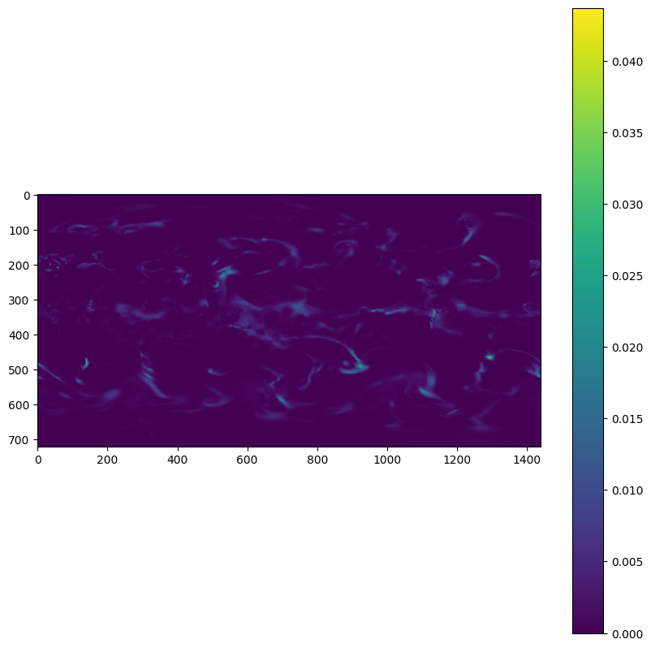

# Tests

## Test 1: Check diagnostic model outputs

Run the distributed diagnostic model example in the parent directory, as indicated in the main
`README`:

```bash
torchrun --standalone --nnodes=1 --nproc-per-node=<NUMBER_OF_GPUS> main.py \
    --config-name=diagnostic.yaml
```

Check that the run finishes without errors. Then run the `check_diagnostic_outputs.py` script:

```bash
python check_diagnostic_outputs.py
```

### Expected Result

You should see an output similar to this:

```bash

```

There should also be a figure as a PNG file for each time step in the prediction in the
`test_figures` directory. Check that the outputs look reasonable for all time steps. Below
is an example:

