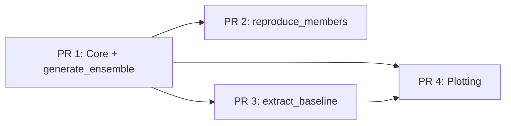

# Splitting the TC Tracking Recipe into Incremental PRs

Breakdown into 4 PRs, ordered from foundational to supplementary. Each PR is self-contained and reviewable on its own.

---

## PR 1 -- Core infrastructure + `generate_ensemble` mode

The bulk of the code. Introduces the full pipeline for running AI weather model ensembles and tracking tropical cyclones with TempestExtremes.

**Files to include:**

- `tc_hunt.py` -- entry point, but only dispatching `generate_ensemble` (no import of `baseline_extraction`, no `reproduce_members` dispatch)
- `src/__init__.py`
- `src/tempest_extremes.py` -- the full TempestExtremes + async wrapper (~1250 lines, core of the recipe)
- `src/utils.py` -- shared helpers
- `src/data/utils.py` -- `DataSourceManager`, `load_heights`
- `src/data/file_output.py` -- output setup for Zarr/NetCDF
- `src/modes/generate_ensembles.py` -- **full file including `reproduce_members`**. Since `reproduce_members` and `generate_ensemble` share `initialise`, `load_model`, `run_inference`, `distribute_runs`, and `configure_runs`, splitting the file would be artificial. The function simply sits unused until PR 2 wires it up.
- `cfg/helene.yaml`, `cfg/hato.yaml` -- example configs for tracking
- `pyproject.toml` -- **without `tropycal`** (only needed by baseline extraction in PR 3)
- `Dockerfile`, `set_envs.sh`, `.gitignore`
- `README.md` -- documenting only the `generate_ensemble` mode
- `test/test_tc_hunt.sh`, `test/cfg/baseline_helene.yaml`, `test/README.md`, `test/.gitignore` -- basic test for the generate mode

**Notes:**

- This is the largest PR but it is all one coherent feature: "run ensemble forecasts and track cyclones".
- `tropycal`, `moviepy`, and plotting-only dependencies can be dropped from `pyproject.toml` for this PR to keep the dependency surface small.
- The `testsource.py` debug script is not part of the recipe proper; leave it out (it is an untracked file anyway).

---

## PR 2 -- Reproduction mode

A very small, easy-to-review PR. Wires up the `reproduce_members` function that already exists in `generate_ensembles.py`.

**Changes:**

- `tc_hunt.py` -- add `reproduce_members` import and dispatch case (~3 lines changed)
- `cfg/reproduce_helene.yaml` -- example config for reproducing specific ensemble members
- `test/cfg/reproduce_helene.yaml` -- test config
- `README.md` -- add documentation for the `reproduce_members` mode

This PR is intentionally tiny. The only new logic is the dispatch wiring and configs; the implementation already landed in PR 1 as part of `generate_ensembles.py`.

---

## PR 3 -- Baseline extraction from reanalysis

Adds the `extract_baseline` mode, which fetches ERA5 reanalysis data, runs TempestExtremes on it, and matches the detected tracks against IBTrACS ground truth.

**Files to include:**

- `src/modes/baseline_extraction.py` -- the full extraction pipeline (~208 lines)
- `tc_hunt.py` -- add `extract_baseline` import and dispatch case
- `cfg/extract_era5.yaml` -- config for Helene + Hato extraction
- `aux_data/ibtracs.HATO_HELENE.list.v04r01.csv` -- IBTrACS subset
- `aux_data/reference_track_hato_2017_west_pacific.csv` -- reference track
- `aux_data/reference_track_helene_2024_north_atlantic.csv` -- reference track
- `test/test_historic_tc_extraction.sh`, `test/cfg/extract_era5.yaml` -- extraction test
- `pyproject.toml` -- add `tropycal>=1.4` dependency
- `README.md` -- add documentation for `extract_baseline`

**Notes:**

- This is the only PR that adds `tropycal` as a dependency (used for IBTrACS access).
- The `aux_data/` CSV files are small reference datasets, fine to commit.

---

## PR 4 -- Plotting and analysis tools

Adds the visualisation and analysis tooling. Entirely optional for the core pipeline to work; can be merged last or even deferred.

**Files to include:**

- `plotting/analyse_n_plot.py`
- `plotting/data_handling.py`
- `plotting/plotting_helpers.py`
- `plotting/plot_tracks_n_fields.ipynb`
- `plotting/tracks_slayground.ipynb`
- `plotting/README.md`
- `plotting/.gitignore`
- `pyproject.toml` -- ensure `cartopy`, `matplotlib`, `moviepy` are present (likely already there from PR 1, but verify)

---

## Dependency flow between PRs

PR 2, PR 3, and PR 4 all depend on PR 1. PR 3 and PR 4 are independent of PR 2. PR 4 may reference outputs from PR 3 (reference tracks), so ordering PR 3 before PR 4 is ideal but not strictly required.

---

## Implementation approach

For each PR, we create a branch off main and stage only the relevant files. Since all files are new (no modifications to existing e2s files), this is straightforward -- each PR is a subset of the current `recipes/tc_tracking/` directory. The main work is:

1. For PR 1: temporarily strip `tc_hunt.py` to only handle `generate_ensemble`, and trim `pyproject.toml` dependencies.
2. For PR 2: minimal diff -- add 3 lines to `tc_hunt.py` + config files.
3. For PR 3: add `baseline_extraction.py` + wiring + configs + aux data + tropycal dep.
4. For PR 4: add `plotting/` directory.

Each subsequent PR is a clean additive diff on top of the previous one.

---

## PR 1 execution log (for LLM context when implementing PRs 2--4)

### Branch and remote layout

- **Remote `origin`**: `git@github.com:mariusaurus/earth2studio.git` (fork)
- **Remote `upstream`**: `https://github.com/NVIDIA/earth2studio.git` (upstream)
- **Branch `mkoch/tc_tracking`**: the full, unmodified TC tracking recipe (all modes, all files). This is the **source of truth** for any code, configs, READMEs, or test files that were removed during PR 1 trimming. When implementing PRs 2--4, **copy files and text directly from `mkoch/tc_tracking`** rather than writing new content from scratch. Use `git show mkoch/tc_tracking:<path>` to retrieve individual files.
- **Branch `mkoch/tc_hunt_1`**: PR 1 working branch. This is where the trimmed recipe lives after the changes described below. PRs 2--4 should be branched from `mkoch/tc_hunt_1` (or from whatever branch results from merging PR 1 into main).

### What was done for PR 1

16 files were deleted and 6 files were modified. All changes are within `recipes/tc_tracking/`.

**Deleted files (16):**

- `src/modes/baseline_extraction.py`
- `cfg/extract_era5.yaml`
- `cfg/reproduce_helene.yaml`
- `aux_data/ibtracs.HATO_HELENE.list.v04r01.csv`
- `aux_data/reference_track_hato_2017_west_pacific.csv`
- `aux_data/reference_track_helene_2024_north_atlantic.csv`
- `plotting/.gitignore`
- `plotting/README.md`
- `plotting/analyse_n_plot.py`
- `plotting/data_handling.py`
- `plotting/plot_tracks_n_fields.ipynb`
- `plotting/plotting_helpers.py`
- `plotting/tracks_slayground.ipynb`
- `test/cfg/extract_era5.yaml`
- `test/cfg/reproduce_helene.yaml`
- `test/test_historic_tc_extraction.sh`

**Modified files (5):**

1. **`tc_hunt.py`**: Removed `from src.modes.baseline_extraction import extract_baseline` and removed `reproduce_members` from the `generate_ensembles` import. Removed the `extract_baseline` and `reproduce_members` dispatch branches. Only `generate_ensemble` mode is wired up. Error message updated to list only `"generate_ensemble"`.

2. **`pyproject.toml`**: Removed `"tropycal>=1.4"` from `dependencies`. All other dependencies (including `cartopy`, `matplotlib`, `moviepy`) were kept. Note: `uv.lock` is now out of sync and should be regenerated with `uv lock` before the PR is opened.

3. **`test/test_tc_hunt.sh`**: Replaced entirely. The original script ran generate_ensemble, then extracted seeds from filenames, patched `reproduce_helene.yaml`, ran reproduce_members, and diffed the results. The new version only runs the generate_ensemble baseline and verifies that at least one track CSV was produced.

4. **`test/README.md`**: Replaced entirely. Removed "Test 2: Extracting individual storms from historic data" section. Trimmed "Test 1" to cover only the generate_ensemble run (removed reproduction steps). Renamed to "Test 1: Generate Ensemble Forecast with Cyclone Tracking".

5. **`README.md`**: Six sections were greyed out with `> [!Note]` callouts ("This feature will be available in a future update.") and their content wrapped in collapsed `

Preview
...
` blocks. The Table of Contents entries for these sections have `*(coming soon)*` appended. The mode bullet list in the Section 2 intro has `*(coming soon)*` after `reproduce_members` and `extract_baseline`. The greyed-out sections are:
   - 2.2 Reproduce Individual Ensemble Members
   - 2.3 Extract Reference Tracks from ERA5 Using IBTrACS as Ground Truth
   - 3 Visualisation
   - 5.1 Extract Baseline (Optional)
   - 5.3 Analyse Tracks
   - 5.4 Reproduce Interesting Members to Extract Fields

**Unchanged files (kept as-is from `mkoch/tc_tracking`):**

- `.gitignore`, `Dockerfile`, `set_envs.sh`, `helene_pred.gif`
- `cfg/helene.yaml`, `cfg/hato.yaml`
- `src/__init__.py`, `src/data/__init__.py`, `src/modes/__init__.py`
- `src/tempest_extremes.py`, `src/utils.py`, `src/data/utils.py`, `src/data/file_output.py`
- `test/.gitignore`, `test/cfg/baseline_helene.yaml`
- `aux_data/orography.nc`
- `uv.lock`
- `PR_SPLIT_PLAN.md` (this file)

6. **`src/modes/generate_ensembles.py`**: Removed `reproduce_members` and `set_reproduction_configs` functions (they were unused dead code). Also removed the `from omegaconf import OmegaConf` import (only used by `set_reproduction_configs`) and `remove_duplicates` from the `src.utils` import (only used by `set_reproduction_configs`). These must be restored in PR 2.

**Deviation from original plan:**
- The original plan kept `generate_ensembles.py` unchanged (with `reproduce_members` and `set_reproduction_configs` sitting unused). This was later revised to remove them for a cleaner PR 1 with no dead code. PR 2 now needs to add them back.
- The original plan mentioned possibly removing `moviepy` and plotting-only deps from `pyproject.toml`. In practice, only `tropycal` was removed because the other deps are either harmless or potentially useful for users doing their own analysis.

### Instructions for implementing PR 2 (reproduce_members)

The `reproduce_members` and `set_reproduction_configs` functions were removed from `src/modes/generate_ensembles.py` during PR 1 trimming. They need to be restored from `mkoch/tc_tracking`. The following changes are needed:

1. **`src/modes/generate_ensembles.py`**: Restore the two removed functions and their dependencies:
   - Add `from omegaconf import OmegaConf` to the imports (was removed in PR 1).
   - Add `remove_duplicates` back to the `from src.utils import (...)` block.
   - Add back the `set_reproduction_configs` function (place it after `configure_runs`, before `generate_ensemble`).
   - Add back the `reproduce_members` function (place it after `generate_ensemble`, at the end of the file).
   - Copy all of these from `mkoch/tc_tracking:recipes/tc_tracking/src/modes/generate_ensembles.py`.

2. **`tc_hunt.py`**: Add `reproduce_members` to the import from `src.modes.generate_ensembles` and add an `elif cfg.mode == "reproduce_members"` dispatch branch. Copy the exact import and dispatch pattern from `mkoch/tc_tracking:recipes/tc_tracking/tc_hunt.py`.

2. **`cfg/reproduce_helene.yaml`**: Copy from `mkoch/tc_tracking` using `git show mkoch/tc_tracking:recipes/tc_tracking/cfg/reproduce_helene.yaml`.

3. **`test/cfg/reproduce_helene.yaml`**: Copy from `mkoch/tc_tracking` using `git show mkoch/tc_tracking:recipes/tc_tracking/test/cfg/reproduce_helene.yaml`.

4. **`test/test_tc_hunt.sh`**: Restore the reproduction section that was removed in PR 1. Copy the full script from `mkoch/tc_tracking:recipes/tc_tracking/test/test_tc_hunt.sh`.

5. **`README.md`**: Un-grey section 2.2 (Reproduce Individual Ensemble Members). Remove the `> [!Note]` callout and `
` wrapper. Remove the `*(coming soon)*` marker from the TOC entry for 2.2 and from the `reproduce_members` bullet in the mode list. The content inside the `
` block is already the correct text (preserved unchanged from the original).

6. **`test/README.md`**: Restore the reproduction part of Test 1. Copy from `mkoch/tc_tracking:recipes/tc_tracking/test/README.md` and include everything up to (but not including) "Test 2".

7. **Section 5.4 in README.md**: Un-grey this section too (it describes reproducing interesting members). Same approach: remove callout + details wrapper, remove `*(coming soon)*` from TOC.

### Instructions for implementing PR 3 (extract_baseline)

1. **`src/modes/baseline_extraction.py`**: Copy from `mkoch/tc_tracking` using `git show mkoch/tc_tracking:recipes/tc_tracking/src/modes/baseline_extraction.py`.

2. **`tc_hunt.py`**: Add `from src.modes.baseline_extraction import extract_baseline` and add the `elif cfg.mode == "extract_baseline"` dispatch branch. Copy pattern from `mkoch/tc_tracking`.

3. **`cfg/extract_era5.yaml`**: Copy from `mkoch/tc_tracking`.

4. **`aux_data/ibtracs.HATO_HELENE.list.v04r01.csv`**: Copy from `mkoch/tc_tracking`.

5. **`aux_data/reference_track_hato_2017_west_pacific.csv`**: Copy from `mkoch/tc_tracking`.

6. **`aux_data/reference_track_helene_2024_north_atlantic.csv`**: Copy from `mkoch/tc_tracking`.

7. **`test/test_historic_tc_extraction.sh`**: Copy from `mkoch/tc_tracking`.

8. **`test/cfg/extract_era5.yaml`**: Copy from `mkoch/tc_tracking`.

9. **`pyproject.toml`**: Add `"tropycal>=1.4"` back to the `dependencies` list (between `tqdm` and `zarrdump` alphabetically). Regenerate `uv.lock`.

10. **`README.md`**: Un-grey sections 2.3 (Extract Reference Tracks) and 5.1 (Extract Baseline). Remove callouts, details wrappers, and `*(coming soon)*` markers. Remove `*(coming soon)*` from the `extract_baseline` bullet in the mode list.

11. **`test/README.md`**: Add back "Test 2: Extracting individual storms from historic data". Copy from `mkoch/tc_tracking:recipes/tc_tracking/test/README.md`.

### Instructions for implementing PR 4 (plotting)

1. **Copy entire `plotting/` directory from `mkoch/tc_tracking`**: `.gitignore`, `README.md`, `analyse_n_plot.py`, `data_handling.py`, `plot_tracks_n_fields.ipynb`, `plotting_helpers.py`, `tracks_slayground.ipynb`.

2. **`README.md`**: Un-grey section 3 (Visualisation) and section 5.3 (Analyse Tracks). Remove callouts, details wrappers, and `*(coming soon)*` markers from those sections and their TOC entries.

3. **`pyproject.toml`**: Verify `cartopy`, `matplotlib`, `moviepy` are present (they should already be there from PR 1).

### General guidance for the implementing LLM

- **Do not write code or README text from scratch.** Always copy from `mkoch/tc_tracking` branch. Use `git show mkoch/tc_tracking:recipes/tc_tracking/<path>` to retrieve file contents.
- **Un-greying README sections** means: (a) remove the `> [!Note]\n> This feature will be available in a future update.` callout, (b) remove the `

Preview
` and `
` wrappers (keeping the content between them), (c) remove the `*(coming soon)*` suffix from the corresponding TOC entry and mode bullet list.
- **Each PR should be a clean additive diff** on top of the previous one. No files should be removed in PRs 2--4; only additions and modifications.
- **Regenerate `uv.lock`** with `uv lock` whenever `pyproject.toml` changes.
- **Do not commit** `testsource.py` or `cfg/test_helene.yaml` -- these are local debug/test files (untracked).
