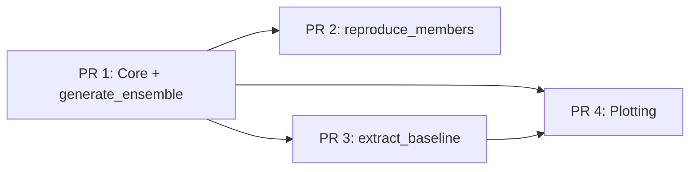

# Splitting the TC Tracking Recipe into Incremental PRs

Breakdown into 4 PRs, ordered from foundational to supplementary. Each PR is self-contained and reviewable on its own.

---

## PR 1 -- Core infrastructure + `generate_ensemble` mode

The bulk of the code. Introduces the full pipeline for running AI weather model ensembles and tracking tropical cyclones with TempestExtremes.

**Files to include:**

- `tc_hunt.py` -- entry point, but only dispatching `generate_ensemble` (no import of `baseline_extraction`, no `reproduce_members` dispatch)
- `src/__init__.py`
- `src/tempest_extremes.py` -- the full TempestExtremes + async wrapper (~1250 lines, core of the recipe)
- `src/utils.py` -- shared helpers
- `src/data/utils.py` -- `DataSourceManager`, `load_heights`
- `src/data/file_output.py` -- output setup for Zarr/NetCDF
- `src/modes/generate_ensembles.py` -- **full file including `reproduce_members`**. Since `reproduce_members` and `generate_ensemble` share `initialise`, `load_model`, `run_inference`, `distribute_runs`, and `configure_runs`, splitting the file would be artificial. The function simply sits unused until PR 2 wires it up.
- `cfg/helene.yaml`, `cfg/hato.yaml` -- example configs for tracking
- `pyproject.toml` -- **without `tropycal`** (only needed by baseline extraction in PR 3)
- `Dockerfile`, `set_envs.sh`, `.gitignore`
- `README.md` -- documenting only the `generate_ensemble` mode
- `test/test_tc_hunt.sh`, `test/cfg/baseline_helene.yaml`, `test/README.md`, `test/.gitignore` -- basic test for the generate mode

**Notes:**

- This is the largest PR but it is all one coherent feature: "run ensemble forecasts and track cyclones".
- `tropycal`, `moviepy`, and plotting-only dependencies can be dropped from `pyproject.toml` for this PR to keep the dependency surface small.
- The `testsource.py` debug script is not part of the recipe proper; leave it out (it is an untracked file anyway).

---

## PR 2 -- Reproduction mode

A very small, easy-to-review PR. Wires up the `reproduce_members` function that already exists in `generate_ensembles.py`.

**Changes:**

- `tc_hunt.py` -- add `reproduce_members` import and dispatch case (~3 lines changed)
- `cfg/reproduce_helene.yaml` -- example config for reproducing specific ensemble members
- `test/cfg/reproduce_helene.yaml` -- test config
- `README.md` -- add documentation for the `reproduce_members` mode

This PR is intentionally tiny. The only new logic is the dispatch wiring and configs; the implementation already landed in PR 1 as part of `generate_ensembles.py`.

---

## PR 3 -- Baseline extraction from reanalysis

Adds the `extract_baseline` mode, which fetches ERA5 reanalysis data, runs TempestExtremes on it, and matches the detected tracks against IBTrACS ground truth.

**Files to include:**

- `src/modes/baseline_extraction.py` -- the full extraction pipeline (~208 lines)
- `tc_hunt.py` -- add `extract_baseline` import and dispatch case
- `cfg/extract_era5.yaml` -- config for Helene + Hato extraction
- `aux_data/ibtracs.HATO_HELENE.list.v04r01.csv` -- IBTrACS subset
- `aux_data/reference_track_hato_2017_west_pacific.csv` -- reference track
- `aux_data/reference_track_helene_2024_north_atlantic.csv` -- reference track
- `test/test_historic_tc_extraction.sh`, `test/cfg/extract_era5.yaml` -- extraction test
- `pyproject.toml` -- add `tropycal>=1.4` dependency
- `README.md` -- add documentation for `extract_baseline`

**Notes:**

- This is the only PR that adds `tropycal` as a dependency (used for IBTrACS access).
- The `aux_data/` CSV files are small reference datasets, fine to commit.

---

## PR 4 -- Plotting and analysis tools

Adds the visualisation and analysis tooling. Entirely optional for the core pipeline to work; can be merged last or even deferred.

**Files to include:**

- `plotting/analyse_n_plot.py`
- `plotting/data_handling.py`
- `plotting/plotting_helpers.py`
- `plotting/plot_tracks_n_fields.ipynb`
- `plotting/tracks_slayground.ipynb`
- `plotting/README.md`
- `plotting/.gitignore`
- `pyproject.toml` -- ensure `cartopy`, `matplotlib`, `moviepy` are present (likely already there from PR 1, but verify)

---

## Dependency flow between PRs

PR 2, PR 3, and PR 4 all depend on PR 1. PR 3 and PR 4 are independent of PR 2. PR 4 may reference outputs from PR 3 (reference tracks), so ordering PR 3 before PR 4 is ideal but not strictly required.

---

## Implementation approach

For each PR, we create a branch off main and stage only the relevant files. Since all files are new (no modifications to existing e2s files), this is straightforward -- each PR is a subset of the current `recipes/tc_tracking/` directory. The main work is:

1. For PR 1: temporarily strip `tc_hunt.py` to only handle `generate_ensemble`, and trim `pyproject.toml` dependencies.
2. For PR 2: minimal diff -- add 3 lines to `tc_hunt.py` + config files.
3. For PR 3: add `baseline_extraction.py` + wiring + configs + aux data + tropycal dep.
4. For PR 4: add `plotting/` directory.

Each subsequent PR is a clean additive diff on top of the previous one.
